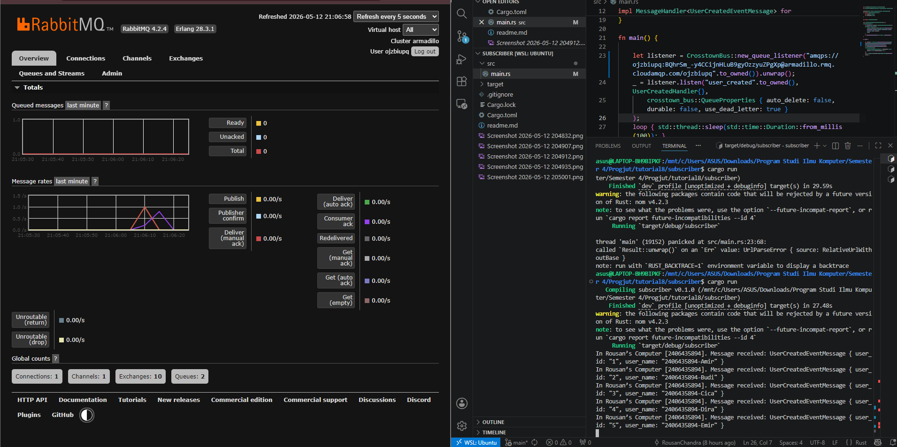

What is amqp? 
Jawab:
AMQP (Advanced Message Queuing Protocol) adalah protokol standar yang digunakan oleh message broker (seperti RabbitMQ) untuk menerima, menyimpan, dan meneruskan pesan antar sistem.

What does guest:guest@localhost:5672 mean? 
Jawab:
Itu adalah URL koneksi ke RabbitMQ.
guest (pertama) = Username default RabbitMQ.
guest (kedua) = Password default RabbitMQ.
localhost = Alamat server (karena RabbitMQ nanti akan dijalankan di laptopmu sendiri via Docker).
5672 = Port standar yang digunakan untuk protokol AMQP.

    

Mengapa antrian di RabbitMQ turun lebih cepat saat ada 3 subscriber?

Karena beban kerja dibagi secara Round Robin ke beberapa subscriber, sehingga total throughput sistem meningkat

